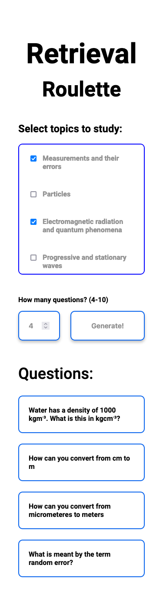

# Retrieval Roulette (simple)

## Overview
A site intended to be used as an A-level physics starter and revision resource. The pupil chooses the subtopics they wish to cover and how many questions they want to answer. The site then generates random questions on those topics.

Clicking on a question reveals the answer, clicking again shows the question (think flashcards).

[Live Site](https://ewhite1999.github.io/physics-starter/)

## Screenshot

## Sister-site

There is a more complex version of this site where the pupil can select a topic and subtopic to revise. Here is a [link to the sister-site repo](https://github.com/ewhite1999/retrieval-roulette).
